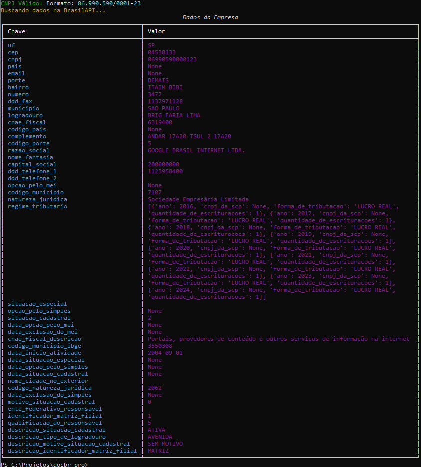
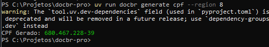
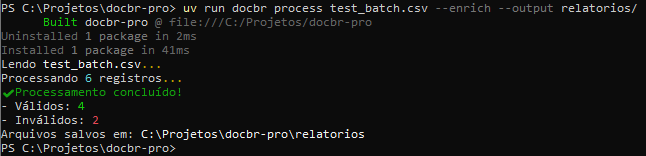
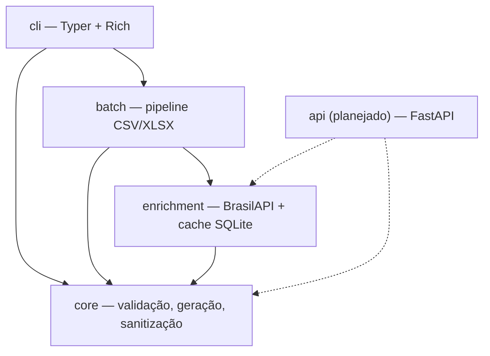

<div align="center">

# docbr-pro

**A única ferramenta que valida, corrige, enriquece e processa CPF/CNPJ em massa — do terminal ou como biblioteca.**

[](https://github.com/leosgarcia/docbr-pro/actions)
[](#testes-e-qualidade)
[](https://pypi.org/project/docbr-pro/)
[](https://www.python.org/)
[](LICENSE)
[](https://pypi.org/project/docbr-pro/)

</div>

---



## Por que este projeto existe

A grande maioria das bibliotecas de validação de CPF/CNPJ no ecossistema Python e JavaScript brasileiro faz uma única coisa: confere o dígito verificador matemático e devolve `True` ou `False`. Isso resolve um problema de 2015 — não o de uma empresa que precisa, hoje, limpar uma planilha de 50 mil clientes com documentos mal formatados, saber quais CNPJs seguem ativos na Receita Federal, ou já validar o novo formato **alfanumérico** que entrou em produção em julho de 2026.

`docbr-pro` nasceu para cobrir essa distância:

| | Bibliotecas tradicionais (ex. `validate-docbr`) | `docbr-pro` |
|---|---|---|
| Validação de dígito verificador | ✅ | ✅ |
| CNPJ alfanumérico (formato 2026) | ❌ | ✅ |
| Correção automática de input sujo (fuzzy fixing) | ❌ | ✅ |
| Detecção de região fiscal do CPF | ❌ | ✅ |
| Enriquecimento de dados via BrasilAPI (razão social, situação cadastral, CNAE) | ❌ | ✅ |
| Processamento em massa de CSV/XLSX com relatório de erros | ❌ | ✅ |
| Interface de terminal rica (tabelas, progresso, cores semânticas) | ❌ | ✅ |
| Uso como biblioteca **e** como CLI | parcial | ✅ |

## Funcionalidades

- ✅ **Validação** — CPF e CNPJ, incluindo o novo formato alfanumérico (módulo 11 com conversão ASCII).
- ✅ **Geração** — documentos válidos para testes, com CPF contextual por região fiscal e CNPJ no formato numérico ou alfanumérico.
- ✅ **Fuzzy fixing** — reconstitui zeros à esquerda perdidos em exportações de Excel e normaliza ruído comum de input humano.
- ✅ **Enriquecimento (OSINT)** — consulta assíncrona à BrasilAPI para razão social, situação cadastral e CNAE de CNPJs válidos, com cache local em SQLite.
- ✅ **Processamento em massa** — pipeline completo sobre CSV/XLSX: sanitiza, valida, enriquece e exporta relatórios separados de válidos e inválidos.
- ✅ **CLI rica** — construída com `Typer` e `Rich`: tabelas, barras de progresso e saída colorida por padrão.

## Instalação

Como biblioteca, em qualquer projeto Python 3.11+:

```bash
pip install docbr-pro
# ou, com uv:
uv add docbr-pro
```

Como ferramenta de linha de comando isolada:

```bash
pipx install docbr-pro
```

## Quickstart

### Como biblioteca

```python
from docbr_pro.core.cpf import validate_cpf, get_fiscal_region
from docbr_pro.core.cnpj import validate_cnpj

validate_cpf("529.982.247-25")        # True
get_fiscal_region("529.982.247-25")   # "SP"
validate_cnpj("06.990.590/0001-23")   # True — suporta formato numérico e alfanumérico
```

### Como CLI

```bash
docbr validate "06.990.590/0001-23" --enrich
```

```
┌─────────────────────────── Resultado ───────────────────────────┐
│ Documento       06.990.590/0001-23                               │
│ Tipo            CNPJ (numérico)                                  │
│ Status          ✅ Válido                                        │
│ Razão Social    GOOGLE BRASIL INTERNET LTDA.                     │
│ Situação        Ativa                                            │
│ CNAE Principal  6319-4/00 - Portais, provedores de conteúdo...   │
└────────────────────────────────────────────────────────────────┘
```



```bash
docbr generate cnpj --alphanumeric
docbr process base_clientes.csv --enrich
```



## Referência de CLI

| Comando | Descrição | Flags principais |
|---|---|---|
| `docbr validate <documento>` | Valida um CPF ou CNPJ pontual | `--enrich` (consulta BrasilAPI para CNPJ) |
| `docbr generate cpf` | Gera um CPF válido | `--region <código>` (região fiscal de emissão) |
| `docbr generate cnpj` | Gera um CNPJ válido | `--alphanumeric` (formato 2026) |
| `docbr process <arquivo.csv\|.xlsx>` | Executa o pipeline completo em massa | `--enrich`, `--column <nome>` |

Execute `docbr --help` ou `docbr <comando> --help` para a lista completa de opções.

## Arquitetura

O projeto é organizado em camadas com regra de dependência estrita: `core` é domínio puro (sem I/O, sem rede) e não depende de nenhuma outra camada — isso é o que permite reaproveitar toda a regra de negócio numa futura API HTTP sem reescrever nada.



## Testes e qualidade

- **Tipagem estática:** `mypy --strict` sem ressalvas em toda a base.
- **Lint e formatação:** `ruff`.
- **Cobertura:** ~90% nos pipelines assíncronos e 100% nos validadores do `core`, incluindo testes baseados em propriedades com `hypothesis` (round-trip: todo documento gerado pela ferramenta é validado como válido pela própria ferramenta).
- **Gerenciamento de dependências:** `uv`.

```bash
uv run pytest --cov
uv run mypy .
uv run ruff check .
```

## Roadmap

- [x] Validação e geração de CPF/CNPJ, incluindo formato alfanumérico
- [x] Fuzzy fixing e sanitização de input
- [x] Enriquecimento via BrasilAPI com cache SQLite
- [x] Processamento em massa (CSV/XLSX) via CLI
- [ ] **API REST paga (em breve)** — mesma camada `core` exposta via FastAPI, com autenticação, rate limiting e planos de uso
- [ ] SDKs oficiais em outras linguagens consumindo a futura API
- [ ] Suporte a XLSX com múltiplas planilhas no mesmo arquivo

## Como contribuir

Contribuições são bem-vindas. Veja [`CONTRIBUTING.md`](CONTRIBUTING.md) para o fluxo de desenvolvimento, padrão de commits ([Conventional Commits](https://www.conventionalcommits.org/)) e como rodar a suíte de testes localmente.

## Aviso legal

`docbr-pro` valida **formato e dígitos verificadores** de CPF e CNPJ segundo os algoritmos públicos definidos pela Receita Federal do Brasil (incluindo a Instrução Normativa RFB nº 2.229/2024 para o formato alfanumérico). O enriquecimento de CNPJ consulta exclusivamente a [BrasilAPI](https://brasilapi.com.br/), fonte pública que agrega dados oficiais e abertos da Receita Federal — nenhum dado pessoal sensível é armazenado, revendido ou exposto pela ferramenta. Não existe, nem é objetivo deste projeto, qualquer forma de consulta a dados pessoais de CPF além do cálculo público da região fiscal de emissão.

## Licença

Distribuído sob a licença MIT. Veja [`LICENSE`](LICENSE) para o texto completo.
